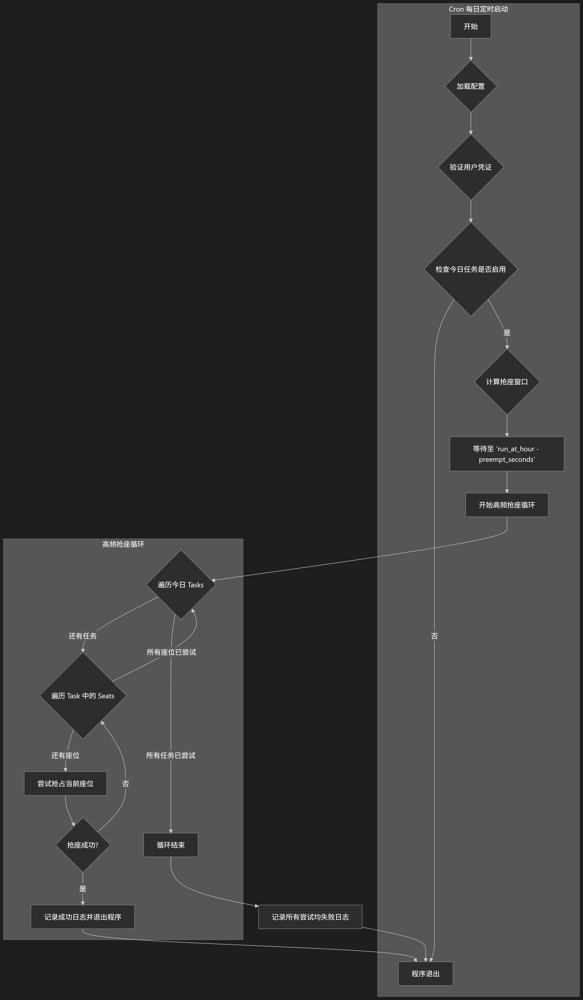

# Seat Killer - 图书馆座位预约脚本

这是一个用于自动预约图书馆座位的 Go 语言脚本。
## 核心功能

1. **凭证预检**：启动时立即验证用户学号密码，避免因配置错误导致任务失败。
2. **优先级座位**：支持配置一个包含多个座位的列表，程序将按顺序（优先级从高到低）尝试抢占。
3. **智能定时**：根据配置的抢座时间（`run_at_hour`）和提前量（`preempt_seconds`），精确抢座。
4. **高频请求**：在抢座时间窗口内，以高频率（可配置）发送预约请求。
5. **完全可配**：通过 YAML 文件，配置你的抢座计划和用户信息。
6. **部署友好**：提供 `crontab` 示例，方便在服务器上进行自动化部署。

## 工作流程



## 如何使用

### 1. 准备工作

- **编译程序**（如果需要）：
  ```bash
  go build -o seat-killer
  ```
  程序依赖 `seat_report.txt` 文件来将房间名和座位号映射为系统内部 ID。请确保此文件存在且内容正确。

### 2. 配置用户信息

创建或修改 `user_info.yml` 文件，填入你的学号和密码。为了安全，此文件已被加入 `.gitignore`，不会被提交到版本库。

```yaml
# user_info.yml
school_id: "你的学号"
password: "你的密码"
```

### 3. 配置预约计划

打开 `user_config.yml` 文件，根据你的需求修改预约计划。这是脚本的核心配置。

```yaml
# user_config.yml

# 全局抢座参数
global:
  preempt_seconds: 15  # 全局设置：提前 15 秒开始抢座

# 每日抢座计划
week_config:
  周一: # 预约目标：周三
    启用: true
    run_at_hour: 20           # 脚本在周一晚上 20:00 (8 PM) 左右运行
    name: "宋韵云图（四楼）"     # 目标房间名称
    seats: ["35", "36", "37"] # 座位优先级: 35 (最高) > 36 (次高) > 37 (保底)
    book_start_hour: 7        # 预约周三早上 7 点的座位
    duration: 15              # 持续 15 小时

  # ... 其他日期的配置
```

**参数详解**:
- **`preempt_seconds`**: 提前多少秒开始进入高频抢座状态。
- **`启用`**: `true` 表示当天会执行抢座任务，`false` 则跳过。
- **`run_at_hour`**: **执行脚本**的时间点（24 小时制）。程序会在此时间点前 `preempt_seconds` 秒被唤醒。
- **`name`**: 目标房间的全名，必须与 `seat_report.txt` 中的完全一致。
- **`seats`**: 一个座位列表，代表了你的抢座优先级。程序会**永远优先尝试列表的第一个座位**，只有当它被占用时，才会在下一次请求中尝试第二个，以此类推。
- **`book_start_hour`**: 你希望预约的**座位的开始时间**（24 小时制）。
- **`duration`**: 你希望预约的座位时长（小时）。

### 4. 运行程序

#### 手动运行 (用于测试)

完成配置后，在项目根目录下运行以下命令：

```bash
go run .
# 或者，如果已经编译
# ./seat-killer
```
程序会启动，分析配置，并自动计算下一次抢座时间。在到达指定时间点前，它会保持静默等待。

#### 自动化部署 (推荐)

使用 `cron` 是实现无人值守抢座的最佳方式。

1.  打开你的 `crontab` 编辑器：
    ```bash
    crontab -e
    ```
2.  参考 `crontab.example` 文件，将类似下面的内容添加到编辑器中（**注意修改路径**）：
    ```cron
    # 每天晚上 19:55 运行 seat-killer 脚本
    55 19 * * * cd /path/to/your/seat-killer && ./seat-killer >> /path/to/your/seat-killer/cron.log 2>&1
    ```
    这条命令会让系统在每天 19:55 自动为你启动抢座程序，并将所有日志记录到 `cron.log` 文件中。


### 快速测试工具 (`fast-test`)

项目包含一个快速测试工具，用于在不运行完整抢座逻辑的情况下，快速验证您的凭据和与图书馆预定系统的连通性。

#### 功能

1.  **凭据验证**: 尝试使用 `user_info.yml` 中的学号和密码登录，验证它们是否正确。
2.  **API连通性测试**: 登录成功后，尝试预定一个无效的座位（ID为0）。这有助于检查API接口是否可达，并观察服务器对错误请求的响应。

#### 如何运行

1.  **编译**: 打开终端，进入 `tools/fast-test` 目录，然后运行以下命令编译工具。

    ```bash
    cd tools/fast-test
    go build
    ```

2.  **运行**: 在 `tools/fast-test` 目录下执行生成的文件。

    ```bash
    ./fast-test
    ```
    或者在项目根目录运行
    ```bash
    go run ./tools/fast-test
    ```

#### 解读输出

- **Login successful!**: 表示您的学号和密码正确无误。
- **Login test failed**: 登录失败。请检查 `user_info.yml` 中的凭据，或者确认学校SSO服务是否正常。
- **Received a response from the booking API**: 这是预期的结果。工具会打印出服务器返回的 `CODE` 和 `MESSAGE`，帮助您了解当前API的状态。如果这里出现网络错误，则表示您的设备与图书馆服务器之间的网络连接存在问题。
